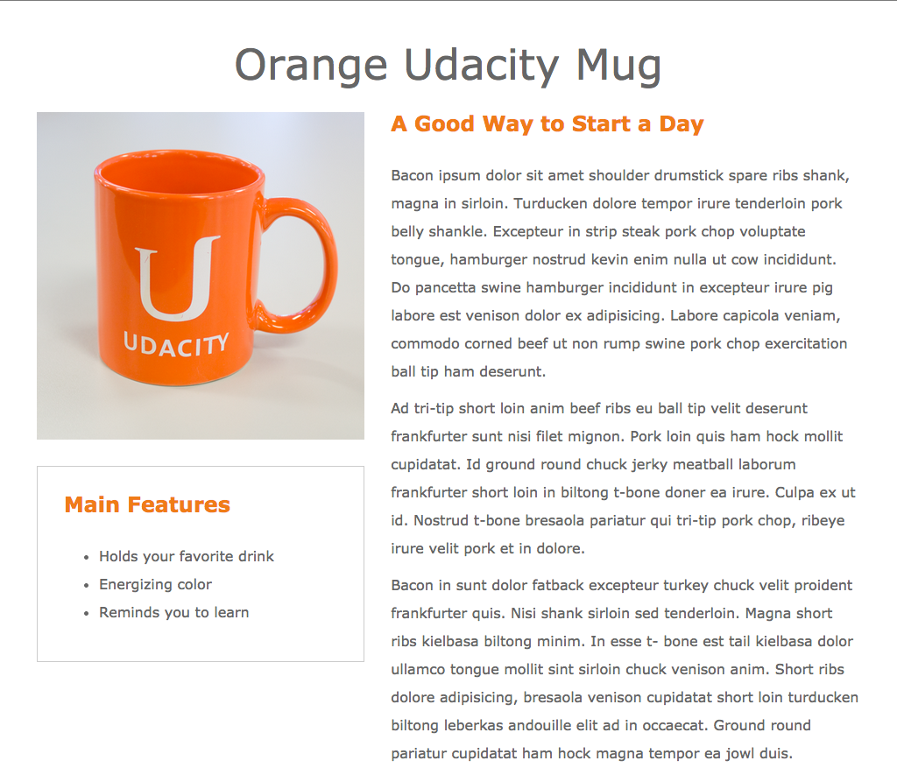

# udacity-nd001-p1-udacity-mug

This code is the result I achieved for ***[Udacity Front-End Web Developer Nanodegree](https://www.udacity.com/course/nd001) - Project 1: Mockup to Website***.

This code has been *reviewed by me and evaluated by Udacity's auto-evaluator with a 0% mismatch*. According to the rubric used by the Udacity reviewer, this should mean that the code:
- [x] Exceeds specifications: Code passes the auto-evaluator with a mismatch of 1% or less;
- [x] Meets specifications: Portfolio completely separates structure (HTML) from design/style (CSS);
- [x] Meets specifications: Code is formatted with consistent, logical, and easy-to-read formatting as described in the Udacity HTML/CSS style guide. Code passes W3C HTML and CSS validation.

A list of websites, books, forums, blog posts, Github repositories etc. that I have referred to or used int his submission can be found in the [references.txt](https://github.com/swesterveld/udacity-nd001-p1-udacity-mug/references.txt) file.

## Mockup
This code is based on the [mockup](https://github.com/swesterveld/udacity-nd001-p1-udacity-mug/images/page-mock.png) given by Udacity. To achieve a pixel-perfect matchup, I have used the mockup-image as an overlay in my HTML. This is how to set up the overlay:

In the HTML, add this code at the end of the body:
```html
    <!-- a diff with an overlay of the mockup, as a reference for the result we want -->
    <div class="mockup-overlay">
      
    </div>
```

In the CSS, add this rule:
```css
.mockup-overlay {
  top: 0;
  position: absolute;
  z-index: -1;
  opacity: 0.4;
}
```
